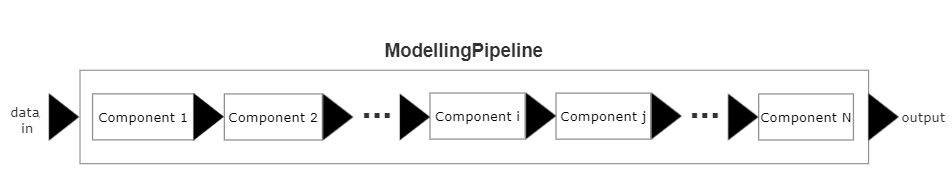
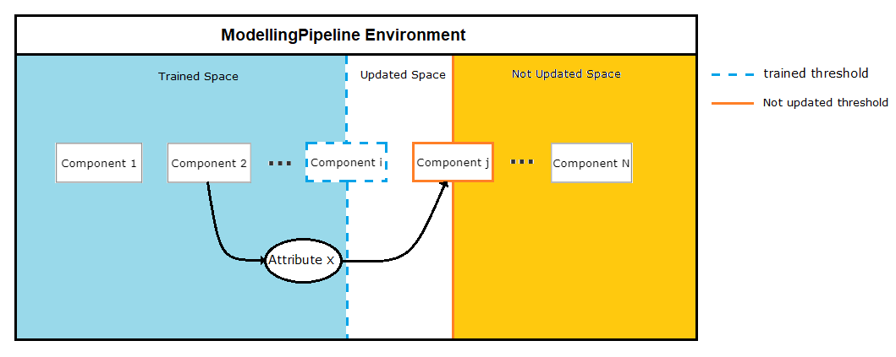

# Machine Learning Pipelines

The field of machine learning is huge, with novel techniques to modelling data being developed all the time. The pace at which advances are made, makes it impossible for any one Python Package to create objects for all techniques, as such the machine learning programmer will often find they have to combine tools from separate packages. Combining tools from different packages into one pipeline can slow development time, as syntaxes, inputs and outputs are not always consistent accross packages.

The Machine Learning Pipelines (MLP) repo has been developed to help coordinate any Machine Learning process where modelling and tranformation tools come from separate packages. MLP is based on the observatiom that applying machine learning techniques/tools to data tends to consist of a common set of processes:

1. **Saving** a model/transformer and it's outputs.
2. **Loading** a trained model/transformer state for reuse.
3. **Fitting** a transformer to data; borrowing from [scikit-learn's](https://scikit-learn.org/stable/data_transforms.html) terminology, where a fit method learns model parameters (e.g. mean and standard deviation for normalization).
4. **Transforming** data (e.g. normalization).
5. **Training** a model.
6. **Predicting** target variables.

**README Contents:**

- [Local Build](#Local-Build)
- [Usage Example](#Usage-Example)
- [Extending pipelines to handle new packages](#Extending-pipelines-to-handle-new-packages)
- [The ModellingPipeline environment](#The-ModellingPipeline-environment)

## Local Build

Clone the project:

```bash
  git clone https://github.com/JHuardC/machine-learning-pipelines.git
```

Use of new virtual environment using Python 3.10.9 or later is recommended.

Use editable install.

Whilst in machine-learning-pipelines dir:

```command
  pip install -e .
```

Or:

```command
  pip install -e \path\to\machine-learning-pipelines
```

[Back to top](#Machine-Learning-Pipelines)


## Usage Example

The `ModellingPipeline` class is the top level class used to coordinate the steps of a modelling process. To maximize flexibility the pipelines are designed to be mutable, allowing a user or another class to alter the pipeline; also, the `ModellingPipeline` contains methods to train and/or apply an individual modelling step, or a specified segment of the pipeline, or the entire pipeline.

Figure 1 represents a modelling task with N steps:



The `ModellingPipeline` contains the methods for each processing step in a `ComponentHandler` class; each component in Figure 1 is a `ComponentHandler` object (Figure 2 shows this aggregation). 


Part 1:
```python
# UTC-8 Encoding

### Set up logging
import logging
logging.basicConfig(
    format='%(asctime)s : %(levelname)s : %(message)s', level=logging.INFO
)

### Get Data
import pathlib as lib
from topic_modelling_pipelines.utils import go_to_ancestor
import pandas as pd

path = go_to_ancestor(lib.Path().absolute(), 'MC_NLP')
petitions = pd.read_csv(path.joinpath('data', 'pet_sample_1pc_42rs.csv'))

### Prep Data - Fill nulls and combine text sections to create full_text
petitions.fillna(
    {'action': '', 'background': '', 'additional_details': ''}, inplace = True
)

petitions['full_text'] = petitions['action'].str.cat(
    petitions[['background', 'additional_details']], sep = ' '
)

### text preprocessing setup
import spacy
from topic_modelling_pipelines.utils import ChainerCleanList
from topic_modelling_pipelines.preprocessing.cleaning_functions import\
    expand_contractions,\
    standardize_whitespace
from topic_modelling_pipelines.preprocessing.gensim_extensions import\
    SpacyGensimBOW


# ChainerCleanList - callable object that sequentially applies functions
preproc = ChainerCleanList(
    standardize_whitespace,
    expand_contractions
)
nlp = spacy.load('en_core_web_sm') # pre-trained pipeline
preprocessor = SpacyGensimBOW(
    nlp, 
    preproc_function = preproc, 
    stop_words = True, 
    lemmatize = True
)

```

Part 2 - Initializing ```ModellingPipeline``` instance:

```Python
### Import gensim models
from gensim.models.tfidfmodel import TfidfModel
from gensim.models import LdaModel

### ModellingPipeline init args set-up
from topic_modelling_pipelines.pipelines import\
    ModellingPipeline, ComponentHandler

sequence = [
    ComponentHandler('preprocessing', preprocessor),
    dict(
        step_name = 'tfidf',
        model = TfidfModel,
        init_kwargs = dict(smartirs = 'ltc')
    ),
    dict(
        step_name = 'latent_var_model',
        model = LdaModel,
        init_kwargs = dict(
            num_topics = 30, 
            chunksize = 512,
            minimum_probability = 0,
            update_every = 1,
            passes = 5
        )
    )
]

pipeline = ModellingPipeline(sequence = sequence)
```

The order in which the preprocessor and gensim models were placed in the sequence variable represents the order in which these objects will be applied to the data in the pipeline.

The sequence variable shows the two alternate ways a processing step can be passed to `ModellingPipeline`: For the preprocessing step,  preprocessor was wrapped in a `ComponentHandler` before being passed to `ModellingPipeline`; for tfidf and latent_var_model steps, the gensim models are passed within a dictionary.

The sequence could have been passed in an alternate form, by not initializing `SpacyGensimBOW` and passing it to a `ComponentHandler`:

```Python
### ModellingPipeline init args set-up
from topic_modelling_pipelines.pipelines import ModellingPipeline

sequence = [
    dict(
        step_name = 'tfidf',
        model = SpacyGensimBOW
        init_kwargs = dict(
            spacy_model = nlp, 
            preproc_function = preproc, 
            stop_words = True, 
            lemmatize = True
        )
    ),
    dict(
        step_name = 'tfidf',
        model = TfidfModel,
        init_kwargs = dict(smartirs = 'ltc')
    ),
    dict(
        step_name = 'latent_var_model',
        model = LdaModel,
        init_kwargs = dict(
            num_topics = 30, 
            chunksize = 512,
            minimum_probability = 0,
            update_every = 1,
            passes = 5
        )
    )
]

pipeline = ModellingPipeline(sequence = sequence)
```

Note how this alternate form did not require `ComponentHandler` to be imported.

Part 3 - Using the pipeline on full text of petitions sampled:

```Python
### Train and extract topic weights
outputs = pipeline.train_apply_pipeline(petitions['full_text'])

```

[Back to Usage Example](#Usage-Example)

[Back to Top](#Machine-Learning-Pipelines)

Currently, the `pipelines` sub-package has a small number of built in concrete Handlers for packages used in topic modelling:

  - Classes belonging to the preprocessing sub-package
  - Gensim classes for vectorization and topic modelling

## Extending `pipelines` to handle new packages

As mentioned above, each component in Figure 1 is a `ComponentHandler` object. The `ComponentHandler` class provides a standardized set of methods for `ModellingPipeline` to call in a processing step. There are four key `ComponentHandler` methods that a `ModellingPipeline` object calls:

  1. update_kwargs()
  2. train()
  3. apply()
  4. train_apply()

`ComponentHandler` composites two further classes: When train, apply, or train_apply is called an 'Implement Handler' object will have it's corresponding methods called by `ComponentHandler`; and when update_kwargs is called a 'Hyperparameter Handler' object will be called.


Any object from any package **must** have unique hyperparameter and implement handler classes. `ComponentHandler` is designed to automatically load the corresponding Hyperparameter and Implement Handler classes for a given object.

`pipelines` provides a trio of modules for custom extensions:

```
  |-- pipelines
      |-- check_factory.py
      |-- hyper_factory.py
      |-- implement_factory.py
```

These modules contain the templates (collections of abstract classes) necessary to build hyperparameter and implement handlers for a specific class/package to be incorporated into a `ModellingPipeline` instance.

`ComponentHandler `contains a Factory Pattern method - `_get_handlers()` - that returns the hyperparameter and implement Handlers corresponding to a specific class. `_get_handlers()` is able to retrieve the correct pair of hyperparameter and implement handlers thanks to a collection of classes referred to as 'check model' classes. These check model classes are aggregate elements of hyperparameter and implement Handlers:


The `check_factory` module is used to create concrete 'check model' classes. `AbstractCheckModel` from Figure 4 (above) is sourced from `check_factory`, which also contains children of `AbstractCheckModel`, who have some of the abstract methods made concrete.

The following code snippet is sourced from the `check_model` module and shows a partially implemented class named `SubclassOfKey`, it's `get_match_description()` and `check_model()` methods have been made concrete:

```Python
class SubclassOfKey(AbstractCheckModel):
    """
    Checks model is a subclass of the provided key.

    Abstract Methods
    ----------------
    get_key. Returns: type or tuple of types.
        Class Method. Corresponding models will be subclasses of the 
        type returned.
    """

    @classmethod
    def get_match_description(
        cls, realization_cls: type[_Handler]
    ) -> str:
        output = ''.join(
            [
                f"{realization_cls} is matched if the model passed is a ",
                f"subclass of one of the following: {cls.get_key()}."
            ]
        )
        return output

    @classmethod
    def check_model(cls, model: _Model) -> bool:
        return issubclass(model, cls.get_key())
```

A concrete check model class can be created using `SubclassOfKey`. The snippet below shows a concrete check model class named `SubclassOfSpacypreproc`, which inherits `SubclassOfKey`.

Any Hyperparameter or Implement Handler containing `SubclassofSpacypreproc` will now be returned to `ComponentHandler` whenever a class from the [preprocessing sub-package](#preprocessing) is passed to `ComponentHandler._get_handlers()`:

```Python
class SubclassOfSpacypreproc(SubclassOfKey):
    
    @classmethod
    def get_key(cls) -> type[SpaCyPipelineModifierABC]:
        return SpaCyPipelineModifierABC
```

`hyper_factory.py` and `implement_factory.py` are structured in the same way as `check_factory.py`.

`hyper_factory.py` contains `AbstractHyperparameterHandler` and a collection of partially implemented children.

`implement_factory.py` contains `AbstractImplementHandler` and it's children.

All the classes in each factory have docstrings explaining the context for using each and listing which methods/attributes would need to be added to build a concrete child class.

Docstring of `AbstractHyperparameterHandler`:

```
hyper_factory.py

AbstractHyperparameterHandler:

    Template for all Hyperparameter Handler classes.

    Root class for all concrete hyperparameter handler classes: The 
    progeny of this class will be used by ComponentHandler.

    Required Class Attributes
    -------------------------
    __check_model: Concrete subclass of AbstractCheckModel.
        Class Attribute. Contains the methods for checking if this class
        is the correct handler class for the passed model.

    Abstract Properties
    --------------------
    _relevant_pipeline_env_keys: tuple[str, ...].
        Some required Hyperparameter values may be derived from 
        previous pipeline steps. In such cases these arguments should be
        retreived using the keys stored in this property.

    Abstract Methods
    ----------------
    _call_with_model_object. Returns: Model.
        This method is called when the model requires initialization.

    _call_with_model_instance. Returns: Model.
        This method is called when the model has been initialized, but 
        updates to it's hyperparameters are required.

    _call_without_hyperparameters. Returns: Model.
        When no hyperparameter values have been specified. Generally 
        implies do nothing but return the model argument as is.
    
    Methods
    -------
    __call__:
        Once initialized, hyperparameter handler classes are called 
        as a functions to update a models' hyperparameters. The call 
        method determines when to call one of the methods:

            _call_with_model_object
            _call_with_model_instance
            _call_without_hyperparameters
    
    get_match_description. Returns: str.
        maps to _check_model's method of the same name. Describes the 
        conditions required for the Hyperparameter/Implement Handler 
        to be called

    has_check_model. Returns: bool.
        Checks whether this class has a _check_model class attribute.

    match_cls_progeny. Returns: Iterable containing class or a subclass.
        Recursive class method. Returns correct handler class for the 
        given model.
```

Docstring of `AbstractImplementHandler`:

```
implement_factory.py

AbstractImplementHandler:

    Template for Implement Handlers used by ComponentHandler to train 
    and apply a model.

    Root class for all concrete implement handler classes: The progeny 
    of this class will be used by ComponentHandler train and apply 
    models.

    Required Class Attributes
    -------------------------
    __check_model: Concrete subclass of AbstractCheckModel.
        Class Attribute. Contains the methods for checking if this class
        is the correct handler class for the passed model.

    Abstract Properties
    -------------------
    pipeline_env_parameters: tuple[str, ...].
        Property. Contains the models's attribute names whose values 
        are to shared with the modelling pipeline's env_vars dictionary.
        
    Abstract Methods
    ----------------
    _train_with_pipeline_access: data_model.
        Pipeline access means the model is to be treated as 
        untrained; with the data passed treated as if it's the initial 
        data the model will be trained with. 
        
        The pipeline access distinction is necessary, because some 
        models will allow further training on  data - for example, a 
        model could initially be trained on data X using gradient 
        descent for 100 iterations, however a local minima may not have 
        been reached in 100 iterations, so another training cycle may be 
        made using X with a follow up training call.

        Returns a named tuple: data_model. The named tuple contains two
        parameters, data and model. Certain models return the processed 
        training data upon being trained, in such instances this can be 
        passed to the data attribute, otherwise the data attribute 
        should default to None.

    _train_without_pipeline_access: data_model.
        No pipeline access implies the model is to be updated if 
        applicable. Note: updating the model means further training 
        an already trained model, not updating the hyperparameters.
        
        The pipeline access distinction is necessary, because some 
        models will allow further training on  data - for example, a 
        model could initially be trained on data X using gradient 
        descent for 100 iterations, however a local minima may not have 
        been reached in 100 iterations, so another training cycle may be 
        made using X with a follow up training call.

        Returns a named tuple: data_model. The named tuple contains two
        parameters, data and model. Certain models return the processed 
        training data upon being trained, in such instances this can be 
        passed to the data attribute, otherwise the data attribute 
        should default to None.

    _apply: Iterable.
        Applies model to data.
        
    Methods
    -------
    train. Returns: _Model.
        Trains the model on data X.

    apply. Returns: Iterable.
        Processes data X on trained model.

    train_apply. Returns: tuple[_Model, Iterable].
        Trains and processes data X.

    _train. Returns: namedtuple data_model.
        Contains the logic for when to call _train_with_pipeline_access 
        or _train_without_pipeline_access. Returns a namedtuple 
        data_model, the namedtuple is used because some models will 
        process or 'apply' themselves to the data when training, in such
        cases it is efficient to return both the trained model and 
        processed data.

    _update_pipeline_env. Returns: None.
        Additional arguments derived for the current model and required 
        by future pipeline steps are sent to the pipeline_env dictionary
        using this method.
```

The following code shows the concrete hyperparameter and implement handlers that will be called when a topic modelling class from gensim (e.g. [models.ldamodel](https://radimrehurek.com/gensim/models/ldamodel.html)) is passed to a `ModellingPipeline`.

```Python
from topic_modelling_pipelines.pipelines.hyper_factory import\
    TrainOnInitializationHandler

from topic_modelling_pipelines.pipelines.implement_factory import\
    UnsupervisedTrainOnInitImplementer, data_model


class GensimHyperparameterHandler(TrainOnInitializationHandler):

    __check_model = SubclassOfGensim

    @property
    def data_kwarg(self) -> str:
        return 'corpus'

    @property
    def _relevant_pipeline_env_keys(self) -> set[str]:
        return {'id2word'}


class ImplementGensimTopic(UnsupervisedTrainOnInitImplementer):
    __check_model = GensimUpdatable

    @property
    def pipeline_env_parameters(self) -> tuple[str, ...]:
        return tuple()

    @property
    def data_kwarg(self) -> str:
        return 'corpus'
    
    def _train_without_pipeline_access(
        self,
        model: _GensimTopicModel,
        X: Iterable,
        y: Union[Iterable, None] = None
    ) -> data_model:
        model.update(X)
        return data_model(None, model)
            
    
    def _apply(self, model: _GensimTopicModel, X: Iterable) -> Iterable:
        return model[X]
```

For more information on `GensimHyperparameterHandler._relevant_pipeline_env_keys` and `ImplementGensimTopic.pipeline_env_parameters` properties, see [The ModellingPipeline environment](#The-ModellingPipeline-environment).

All extensions to classes from `check_factory.py`, `hyper_factory.py`, and `implement_factory.py` made for a specific python package should be contained in a single script, which should be named `{package name}_extensions.py`.

The path to the folder containing a custom `{package name}_extensions.py` script should be passed with the initial arguments for ModellingPipeline.

[Back to Extending pipelines to handle new packages](#Extending-pipelines-to-handle-new-packages)

[Back to Top](#Machine-Learning-Pipelines)

## The ModellingPipeline environment

The example code for [extending pipelines](#Extending-pipelines-to-handle-new-packages) to gensim given above included the creation of a `_relevant_pipeline_env_keys` property for the hyperparameter handler, and a `pipeline_env_parameters` property for the implement handler.

Some hyperparameters for a given component step are generated dynamically from the training of previous steps. Gensim models are good examples, as they require corpus dictionaries (passed to `id2word` on initialization), which can only be generated after applying text cleaning functions to the sample data.

In order for future processing steps in a `ModellingPipeline` to be able to access the dynamically generated hyperparameters they require, a shared space is contained in the `ModellingPipeline`, a dictionary object under the attribute name `env_vars`. Implement handler's `pipeline_env_parameters` provides a collection of attribute names, whose values should be passed to `env_vars` for use by future steps. Hyperparameter handler's `_relevant_pipeline_env_keys` provides a collection of parameter names to be pulled from `env_vars` when updating kwargs.

Figure 5 (below) provides a conceptual diagram of how `env_vars`, in conjunction with two further `ModellingPipeline` properties named `trained_threshold` and `update_threshold`, is used to pass dynamically generated hyperparameters. `Component 2` has generated `Attribute X` upon being trained; the value of `Attribute X` is required as a hyperparameter for `Component j` and so `Attribute X` has been passed into the `ModellingPipeline` environment; when `Component j` is called to update it's model's hyperparameters, `Attribute X` will be passed from the `ModellingPipeline` environment to the component.



The `trained_threshold` and `update_threshold` properties are the markers that track which components `ModellingPipeline` determines to be trained; which require hyperparameter updates; and which components are updated but untrained. `Component i` in Figure 5 has not yet been trained, this has been represented by the dashed trained_threshold line. `Component j` is registered as part of the not-updated space, represented by the solid line.

[Back to The ModellingPipeline environment](#The-ModellingPipeline-environment)

[Back to Top](#Machine-Learning-Pipelines)